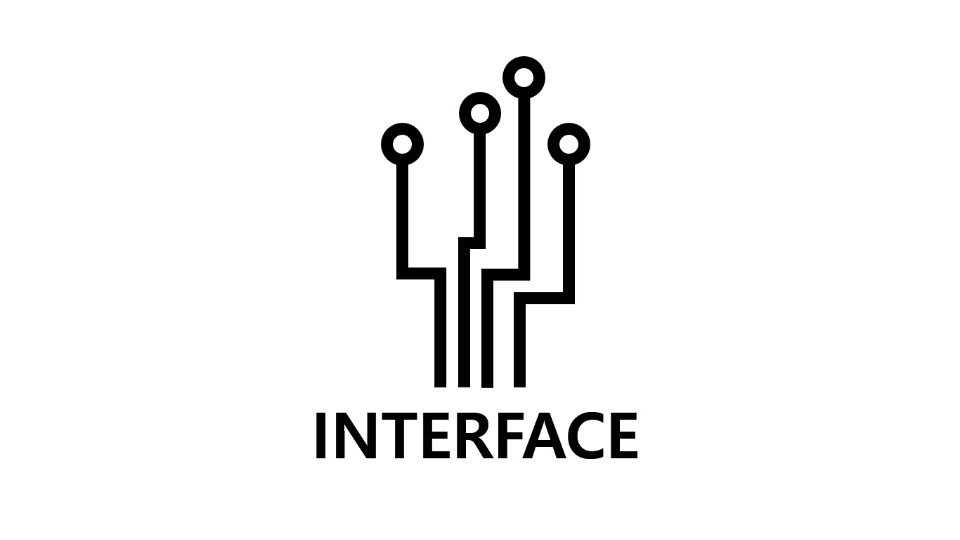

<h1 align="center">인터페이스 깃허브 사용법</h1>

## 세종대학교 중앙 학술동아리 인터페이스

 

저희 인터페이스는 2017년도 부터 모든 동아리 프로젝트를 깃허브를 사용하여 관리하기로 결정하였습니다. 그래서 여러분들에게 깃허브 사용법을 알려드리기 위해 이 문서를 제작하게 되었으며 주로 정보는 Wiki창에서 보실수있습니다. 여러분들의 원활한 동아리 생활을 응원합니다. 
>-인터페이스 31기 집부진 일동-
