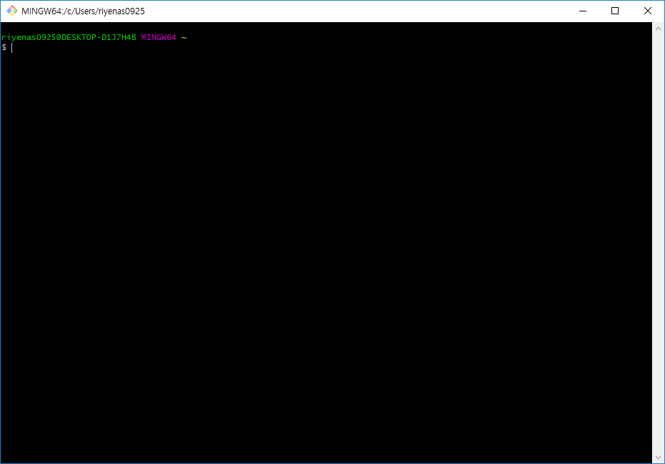
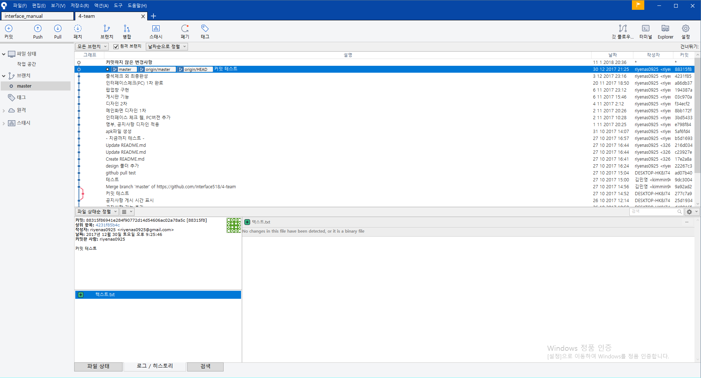
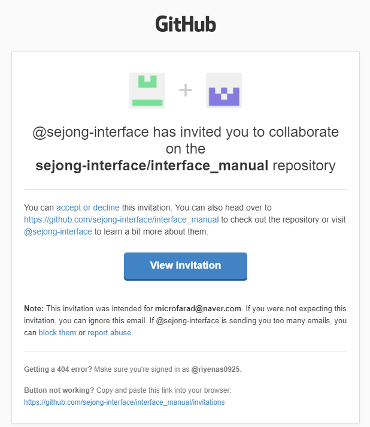
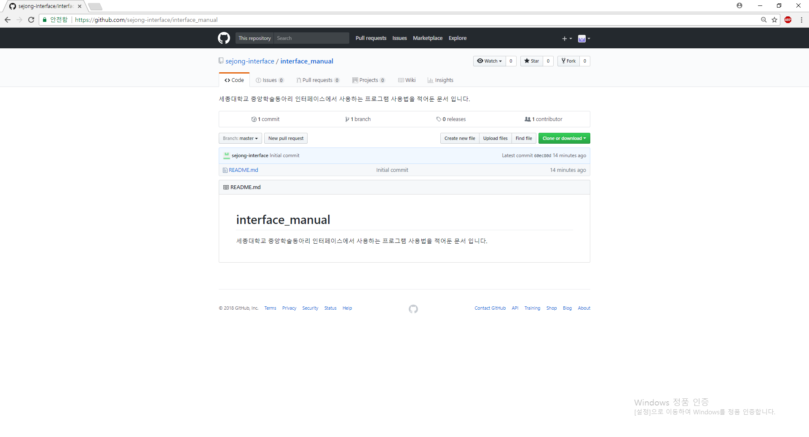
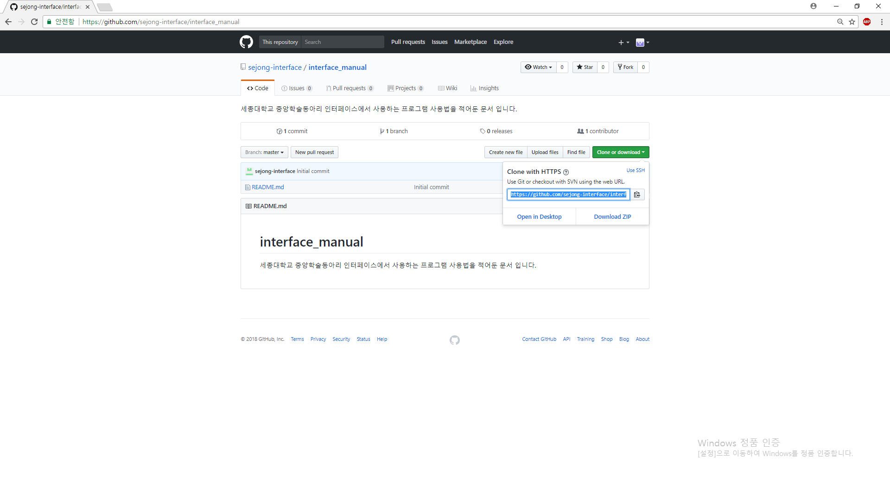
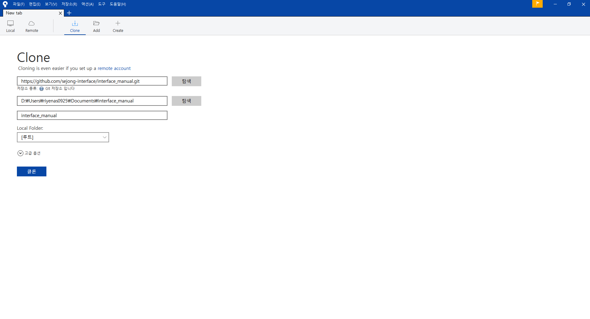

<h1 align="center">인터페이스 깃허브 사용법</h1>

## 세종대학교 중앙 학술동아리 인터페이스

 

저희 인터페이스는 2017년도 부터 모든 동아리 프로젝트를 깃허브를 사용하여 관리하기로 결정하였습니다. 그래서 여러분들에게 깃허브 사용법을 알려드리기 위해 이 문서를 제작하게 되었으며 주로 정보는 Wiki창에서 보실수있습니다. 여러분들의 원활한 동아리 생활을 응원합니다. 
>-인터페이스 31기 집부진 일동-

## **Git**

Git은 리눅스 제작자인 리누스 토발즈가 만든 분산형 버전 관리 프로그램 입니다.

Download link is [here](https://git-scm.com/downloads).

## **Sourcetree**

소스트리는 Git에 대한 그래픽 인터페이스를 제공하는 프로그램입니다.

원래라면 아래와 같은 Git Bash에 코드를 입력해 관리해야하지만 소스트리를 이용하면 사용하기 쉬운 인터페이스를 제공합니다.

>Git Bash

>Sourcetree

Download link is [here](https://www.sourcetreeapp.com/).

## **Github**

대표적인 무료 Git 저장소. 

Site link is [here](https://github.com/)

## 깃허브 프로젝트 참여하기

* 프로젝트를 생성한 관리자가 팀원들을 초대하면 처음 가입할때 기입한 메일로 초대메일이 전송됩니다.

* 중앙의 View invitation을 클릭한다음 accept를 누르면 프로젝트에 참여하게 됩니다.
 

## 소스트리를 이용해 저장소와 연결하기

* 초대받은 프로젝트의 주소로 접속합니다. 

 * 좌측 초록색 버튼인 **Clone or download** 를 눌러 **https:~** 로 시작하는 주소를 복사합니다.

* 소스트리로 이동해 + 버튼을 눌러 New tab를 만든다음 Clone을 눌러 사진과 같은 창이 뜨도록 합니다.

>  
여기서 **소스경로 / URL:** 에 방금 복사한 주소를 붙여넣기 하면 아래 **목적지 경로:** **이름:** 이 자동으로 채워집니다. 
여기서 **목적지 경로:** 는 파일이 저장되는 위치를 말하므로 원하는 위치에 저장하고 싶은 분은 바꾸시면 됩니다.

* 그다음으로 클론 버튼을 누르면 github저장소와 연결 성공!
